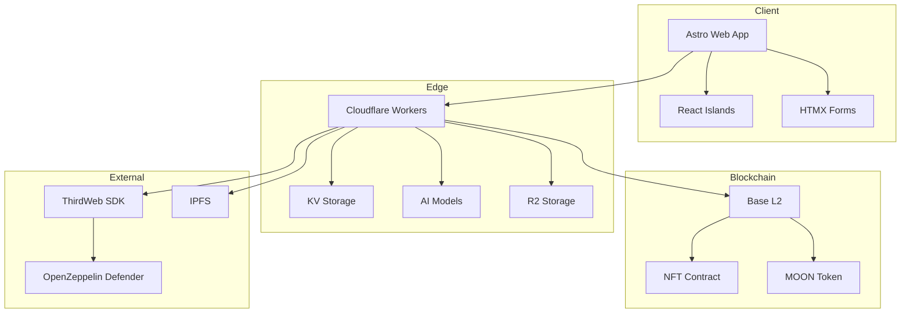

# Moonbirds Art Forge Architecture

## 🏗️ System Overview

Moonbirds Art Forge is a modern web3 application built on a microservices architecture, leveraging edge computing and serverless functions for optimal performance and scalability.



## 📁 Project Structure

```
moonforge/
├── apps/
│   └── web/                 # Frontend application
│       ├── src/
│       │   ├── components/  # Astro/React components
│       │   ├── layouts/     # Page layouts
│       │   ├── pages/       # Route pages
│       │   ├── lib/         # Utilities
│       │   └── styles/      # Global styles
│       └── public/          # Static assets
├── packages/
│   ├── tokens/             # Design system tokens
│   └── nft-minting/        # NFT minting library
├── workers/
│   └── api_generate/       # API worker
│       └── src/
│           ├── index.ts    # Main entry
│           ├── flux.ts     # FLUX integration
│           ├── dalle.ts    # DALL-E integration
│           ├── mint.ts     # NFT minting
│           └── gasless.ts  # Gasless transactions
├── workflows/
│   └── tuner/              # Prompt optimization
└── scripts/                # Build/deploy scripts
```

## 🔧 Core Technologies

### Frontend Stack
- **Astro**: Static site generation with islands architecture
- **React**: Interactive components (wallet, tipping)
- **HTMX**: Progressive enhancement for forms
- **Tailwind CSS**: Utility-first styling
- **TypeScript**: Type safety

### Backend Stack
- **Cloudflare Workers**: Edge computing
- **Hono**: Lightweight web framework
- **KV Storage**: Key-value data persistence
- **R2**: Object storage for images
- **AI Models**: FLUX, DALL-E via Cloudflare AI

### Web3 Stack
- **Base L2**: Ethereum Layer 2 network
- **wagmi/viem**: Web3 React hooks
- **ThirdWeb**: NFT minting infrastructure
- **OpenZeppelin Defender**: Gasless transactions

## 🏛️ Architectural Patterns

### 1. Islands Architecture

Astro delivers a static HTML shell with interactive React "islands" for dynamic functionality:

```astro
---
// Static Astro component
import WalletConnect from './WalletConnect.tsx';
---

<div>
  <h1>Static Content</h1>
  <WalletConnect client:load /> <!-- React island -->
</div>
```

### 2. Edge-First Design

All API logic runs at the edge for minimal latency:

```typescript
// Cloudflare Worker
export default {
  async fetch(request: Request, env: Env) {
    // Process at the edge
    return new Response();
  }
};
```

### 3. Progressive Enhancement

HTMX enables rich interactions without JavaScript:

```html
<form hx-post="/api/generate" 
      hx-target="#result"
      hx-indicator=".loading">
  <!-- Form fields -->
</form>
```

### 4. Composable Services

Modular services for different concerns:

```typescript
// Services composition
const imageService = new ImageGenerationService();
const nftService = new NFTMintingService();
const tipService = new TippingService();
```

## 🔄 Data Flow

### Image Generation Flow

1. User submits prompt via HTMX form
2. Worker receives request at edge
3. AI model generates image
4. Image stored in KV/R2
5. HTML response returned for HTMX swap

### NFT Minting Flow

1. User clicks mint button
2. React component calls API
3. Worker uploads to IPFS
4. Gasless transaction via Defender
5. NFT minted on Base L2

### Tipping Flow

1. User opens tip modal
2. Wallet signs transaction
3. MOON tokens transferred
4. Transaction recorded in API

## 🔐 Security Architecture

### API Security
- CORS configuration
- Rate limiting
- Input validation
- Error sanitization

### Web3 Security
- Wallet signature verification
- Gasless relay authentication
- Contract interaction validation

### Data Security
- KV encryption at rest
- TLS for all traffic
- Minimal PII storage

## 🚀 Deployment Architecture

### Multi-Environment Setup

```
Production:
  - Web: moonbirds-art.com
  - API: api.moonbirds-art.com
  - Contract: Base Mainnet

Staging:
  - Web: staging.moonbirds-art.com
  - API: api-staging.moonbirds-art.com
  - Contract: Base Testnet

Development:
  - Web: localhost:3000
  - API: localhost:8787
  - Contract: Local fork
```

### CI/CD Pipeline

1. **Build Stage**
   - TypeScript compilation
   - Asset optimization
   - Test execution

2. **Deploy Stage**
   - Worker deployment
   - Pages deployment
   - KV migration

3. **Verify Stage**
   - Health checks
   - Smoke tests
   - Performance monitoring

## 📊 Scalability Considerations

### Horizontal Scaling
- Cloudflare Workers auto-scale
- KV replication across regions
- CDN for static assets

### Caching Strategy
- Browser caching for assets
- KV caching for API responses
- AI model result caching

### Performance Optimization
- Image lazy loading
- Code splitting
- Preconnect to APIs

## 🔍 Monitoring & Observability

### Metrics
- Request latency
- AI generation time
- NFT mint success rate
- Tip transaction volume

### Logging
- Structured JSON logs
- Error tracking
- User activity analytics

### Alerts
- API downtime
- High error rates
- KV storage limits
- Wallet balance thresholds

## 🛠️ Development Workflow

### Local Development
```bash
# Start all services
pnpm dev

# Run specific service
pnpm --filter web dev
pnpm --filter api_generate dev
```

### Testing Strategy
- Unit tests for utilities
- Integration tests for APIs
- E2E tests for critical paths
- Visual regression tests

### Code Quality
- ESLint for linting
- Prettier for formatting
- TypeScript for type checking
- Husky for pre-commit hooks

## 🔮 Future Architecture

### Planned Enhancements
1. **WebSocket Support**: Real-time generation updates
2. **Edge Caching**: Reduced AI costs
3. **Multi-Region**: Global deployment
4. **Web3 Social**: Profile system
5. **Mobile SDK**: React Native integration

### Scaling Considerations
- Database migration for complex queries
- Message queue for async processing
- Container support for custom models
- GraphQL API for flexible queries